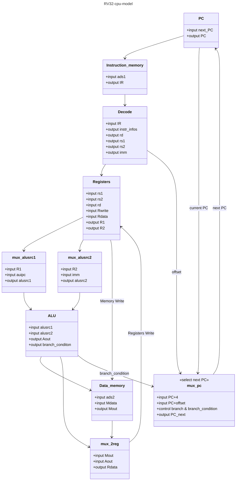

### RV32-cpu-model

```mermaid
---
title: RV32-cpu-model
---
classDiagram
	class PC{
		+input next_PC
		+output PC
	}
	class Instruction_memory{
		+input ads1
		+output IR
	}
	PC --> Instruction_memory
  class Decode{
  	+input IR
  	+output instr_infos
  	+output rd
  	+output rs1
  	+output rs2
  	+output imm
  }
  Instruction_memory --> Decode
  class Registers{
  	+input rs1
  	+input rs2
  	+input rd
  	+input Rwrite
  	+input Rdata
  	+output R1
  	+output R2
  }
  Decode --> Registers
  mux_2reg --> Registers : Registers Write
  class mux_alusrc1{
  	+input R1
  	+input auipc
  	+output alusrc1
  }
  Registers --> mux_alusrc1
  class mux_alusrc2{
  	+input R2
  	+input imm
  	+output alusrc2
  }
  Registers --> mux_alusrc2
  class ALU{
  	+input alusrc1
  	+input alusrc2
  	+output Aout
  	+output branch_conditon
  }
  mux_alusrc1 --> ALU
  mux_alusrc2 --> ALU
  class Data_memory{
  	+input ads2
  	+input Mdata
  	+output Mout
  }
  ALU --> Data_memory
  Registers --> Data_memory : Memory Write
  class mux_2reg{
  	+input Mout
  	+input Aout
  	+output Rdata
  }
  Data_memory --> mux_2reg
  ALU --> mux_2reg
  class mux_pc{
  	<<select next PC>>
  	+input PC+4
  	+input PC+offset
  	+control branch & branch_condition
  	+output PC_next
  }
  PC --> mux_pc : current PC
  ALU --> mux_pc : branch_condition
  Decode --> mux_pc : offset
  mux_pc --> PC : next PC
```

